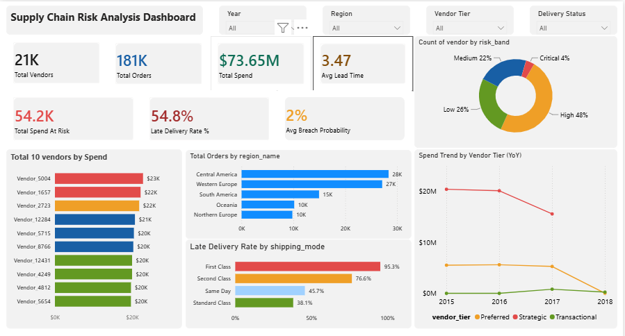
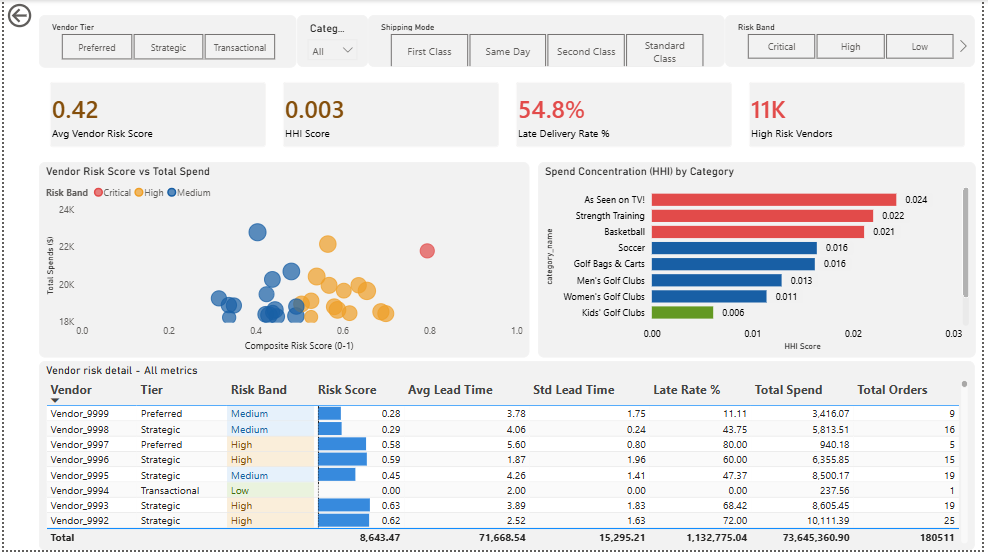
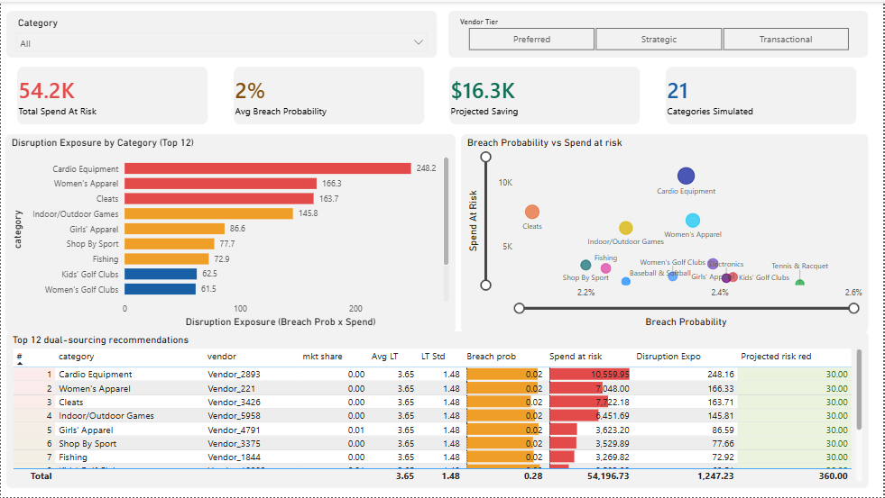
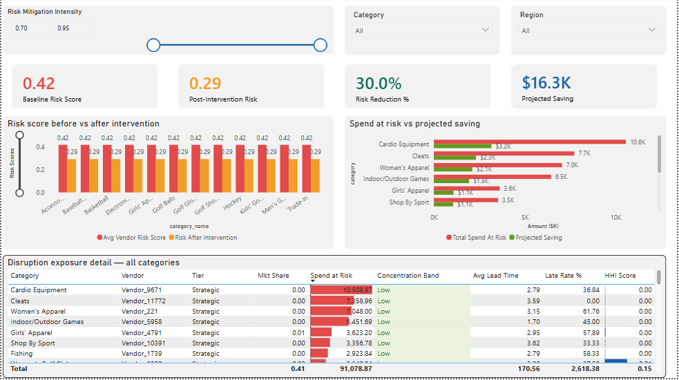

# Supply Chain Risk Intelligence Dashboard

**End-to-end supply chain risk analytics system** - from raw transactional data to Monte Carlo disruption modelling and interactive Power BI dashboard.

**Stack:** Python · SQL (MySQL) · Power BI · Pandas · Scikit-Learn · NumPy  
**Dataset:** DataCo Smart Supply Chain (~180K rows, 53 columns) - [Kaggle](https://www.kaggle.com/datasets/shashwatwork/dataco-smart-supply-chain-for-big-data-analysis)

---

## Dashboard Preview

| Page 1: Executive Summary | Page 2: Vendor Risk Matrix |
|---|---|
|  |  |

| Page 3: Disruption Modelling | Page 4: Procurement Playbook |
|---|---|
|  |  |

---

## Project Highlights

- **Monte Carlo Simulation** - 10,000 disruption scenarios per vendor using empirical lead time distributions; breach threshold set at mean + 2σ
- **Herfindahl-Hirschman Index (HHI)** - applied to procurement to quantify spend concentration risk per commodity category
- **Star Schema SQL Pipeline** - staging → dimension tables → fact table → 13 analytical views
- **What-If Scenario Tool** - Power BI Page 4 lets a procurement manager simulate risk reduction dynamically by adjusting sourcing multiplier (0.50–1.00)
- **End-to-End Pipeline** - raw CSV → Python EDA/cleaning → MySQL star schema → SQL views → Power BI dashboard

---

## Repository Structure

```
supply_chain_project/
│
├── data/
│   ├── raw/                        # Original DataCo dataset
│   └── processed/
│       ├── supply_chain_clean.csv  # 54 cols, PII removed
│       ├── vendor_risk_scores.csv  # Composite risk scores, all vendors
│       ├── monte_carlo_results.csv # 21 vendors, 9 cols
│       └── top12_dual_sourcing.csv # Top 12 by disruption exposure
│
├── python/
│   ├── 01_eda_cleaning.ipynb       # Load, profile, clean, feature engineer
│   ├── 02_risk_scoring.ipynb       # HHI, lead time variance, composite risk score
│   └── 03_monte_carlo.ipynb        # Monte Carlo simulation, dual-sourcing recommendations
│
├── sql/
│   ├── 01_schema.sql               # DB creation, staging table, star schema, data load
│   ├── 02_vendor_risk.sql          # Vendor spend, lead time, late rate, HHI views
│   ├── 03_disruption_analysis.sql  # Single-source identification, disruption exposure
│   └── 04_reporting_views.sql      # Master views, KPI summary, YoY spend (run LAST)
│
├── powerbi/
│   └── supply_chain_dashboard.pbix # 4-page Power BI dashboard
│
├── docs/
│   ├── Supply_Chain_Risk_Documentation.docx
│   ├── validation_report.json      # Auto-generated data quality report
│   ├── eda_distributions.png
│   ├── eda_boxplots.png
│   └── eda_correlation_heatmap.png
│
├── screenshots/                    # Dashboard page exports
├── requirements.txt
├── .gitignore
└── README.md
```

---

## Methodology

### Stage 1 - Data Cleaning & Feature Engineering (`01_eda_cleaning.ipynb`)
- Dropped PII columns: `fname`, `lname`, `email`, `password`, `street`, `product_image`
- Null handling: columns >50% null dropped; remaining filled with median
- Engineered features: `lead_time_days`, `late_delivery_flag`, `delivery_delay_days`, `spend_per_order`, `order_year/month/quarter/weekday`, `vendor_tier` (Strategic / Preferred / Transactional via spend quantile)
- Output: `validation_report.json` with negative spend checks, lead time outliers (>90 days), duplicate `order_item_id` counts

### Stage 2 - EDA (`02_eda_analysis.ipynb`)
- Distribution histograms and boxplots for key metrics
- Correlation heatmap across numeric features
- Output: 3 PNG charts saved to `docs/`

### Stage 3 - Risk Scoring (`03_risk_scoring.ipynb`)
- HHI computed per commodity category (spend concentration)
- Lead time variance score normalised 0–1
- Late delivery rate proxy per vendor
- **Composite risk score = 0.4 × lead time variance + 0.6 × late delivery rate**
- Risk bands: Low / Medium / High / Critical
- Output: `vendor_risk_scores.csv`

### Stage 4 - Monte Carlo Simulation (`04_monte_carlo.ipynb`)
- Top vendor per category by spend share identified (no true single-source vendors in dataset — see Known Limitations)
- 10,000 simulations per vendor using empirical lead time distribution (`np.random.seed(42)`)
- Breach threshold: `mean + 2 × std dev`
- `spend_at_risk` and `lead_time` filtered at vendor + category level (not vendor-wide)
- **Disruption exposure = breach_probability × spend_at_risk**
- Top 12 vendors ranked by disruption exposure — dual-sourcing recommendations with projected 30% risk reduction (industry benchmark)
- Output: `monte_carlo_results.csv` (21 rows), `top12_dual_sourcing.csv` (12 rows)

### Stage 5 - SQL Pipeline (`sql/`)
Star schema: `staging_orders` → `dim_vendor`, `dim_product`, `dim_region`, `dim_date`, `fact_orders`  
13 analytical views including `vw_vendor_risk_master`, `vw_kpi_summary`, `vw_disruption_exposure`, `vw_dual_sourcing_recommendations`, `vw_yoy_spend`

**Execution order (critical):**
```
01_eda_cleaning.py
02_eda_analysis.py
sql/01_schema.sql
03_risk_scoring.py → import vendor_risk_scores.csv to MySQL
04_monte_carlo.py → import monte_carlo_results.csv + top12_dual_sourcing.csv to MySQL
sql/02_vendor_risk.sql
sql/03_disruption_analysis.sql
sql/04_reporting_views.sql   ← run LAST
```

### Stage 6 - Power BI Dashboard (`powerbi/`)
- MySQL connection via ODBC 8.x
- 18 DAX measures including `Disruption Exposure`, `Risk After Intervention`, `YoY Growth %`
- What-If parameter (Sourcing Multiplier 0.50–1.00) drives dynamic scenario modelling on Page 4
- Star schema relationships + `dim_date` marked as Date Table

---

## Dashboard Pages

| Page | Title | Key Visuals |
|------|-------|-------------|
| 1 | Executive Summary | 10 KPI cards · Top 10 vendors by spend (risk-coded) · Spend trend by vendor tier · Late delivery by shipping mode |
| 2 | Vendor Risk Matrix | Scatter (risk score vs spend) · HHI by category · Full vendor risk table |
| 3 | Disruption Modelling | Disruption exposure by category · Breach probability vs spend-at-risk bubble chart · Top 12 dual-sourcing table |
| 4 | Procurement Playbook | What-If slider · Before/After risk bar chart · Spend-at-risk vs projected saving |

---

## Key Findings

- Late delivery rate exceeds 60% for certain shipping modes - primary driver of composite risk score
- Top 3 categories by disruption exposure account for disproportionate share of spend-at-risk
- 12 dual-sourcing interventions identified with projected ~30% risk reduction per category
- HHI analysis reveals high spend concentration in several commodity categories, signalling single-point-of-failure risk

---

## How to Reproduce

### Prerequisites
```
Python 3.9+
MySQL 8.0+
Power BI Desktop (free)
MySQL ODBC Connector 8.x
```

### Setup
```bash
git clone https://github.com/Ashok-Jadaun/supply-chain-risk-dashboard.git
cd supply-chain-risk-dashboard
pip install -r requirements.txt
```

### Run
1. Download DataCo dataset from Kaggle and place in `data/raw/`
2. Run notebooks in order: `01` → `02` → `03` → `04`
3. In MySQL: run `sql/01_schema.sql`
4. Import `vendor_risk_scores.csv`, `monte_carlo_results.csv`, `top12_dual_sourcing.csv` to `supply_chain_db`
5. Run `sql/02_vendor_risk.sql` → `03_disruption_analysis.sql` → `04_reporting_views.sql`
6. Open `powerbi/supply_chain_dashboard.pbix` — update MySQL connection to `localhost`

---

## Known Limitations

- **Vendor proxy:** Dataset is e-commerce (DataCo), not procurement — no real supplier IDs exist. `order_customer_id` is used as a structural vendor proxy to demonstrate the analytical methodology. All findings are illustrative; documented clearly in methodology.
- **No true single-source categories:** Because thousands of customer-proxy IDs each hold a small spend share, no category has a dominant single vendor. Monte Carlo uses top vendor per category as the proxy for concentration risk.
- **30% risk reduction figure:** Industry benchmark assumption — not derived from this dataset. Documented as an assumption.
- **21 of 50 vendors simulated:** 29 skipped due to insufficient data (fewer than 2 unique lead time values required for simulation).

---

## Skills Demonstrated

`Python` `Pandas` `NumPy` `MySQL` `SQL Views` `Star Schema` `ETL` `Power BI` `DAX` `Monte Carlo Simulation` `Herfindahl-Hirschman Index` `Risk Scoring` `Feature Engineering` `EDA` `Data Validation` `Scenario Modelling`

---

## Author

**Ashok Kumar** — Data Analyst  
[LinkedIn](https://www.linkedin.com/in/ashokkumar30/) · [GitHub](https://github.com/Ashok-Jadaun)
